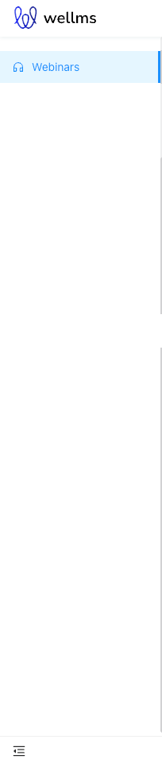
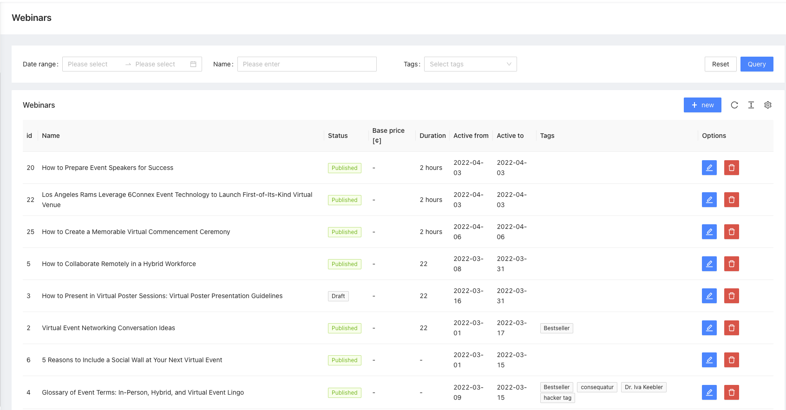
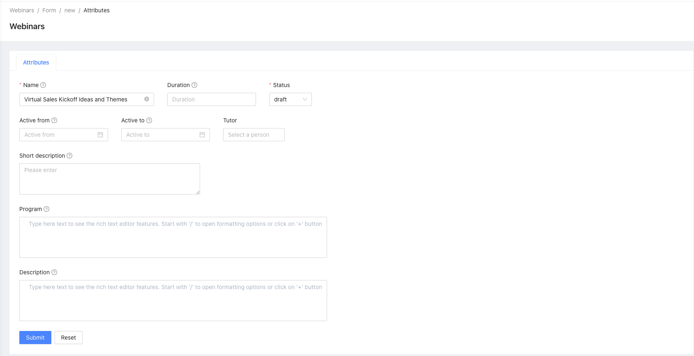

# Webinar
Package enabling live video stream

[](https://escolalms.github.io/Webinar/)
[](https://codecov.io/gh/EscolaLMS/Webinar)
[](https://github.com/EscolaLMS/Webinar/actions/workflows/test.yml)
[](https://packagist.org/packages/escolalms/webinar)
[](https://packagist.org/packages/escolalms/webinar)
[](https://packagist.org/packages/escolalms/webinar)
[](https://codeclimate.com/github/EscolaLMS/Webinar/maintainability)

## What does it do

This package is used for creating Webinar for EscolaLms.

## Installing

- `composer require escolalms/webinar`
- `php artisan migrate`
- `php artisan db:seed --class="EscolaLms\Webinar\Database\Seeders\WebinarsPermissionSeeder"`
- Integration with [Youtube](https://github.com/EscolaLMS/Youtube)

## Schedule

- In App\Console\Kernel to method schedule add 
  - `$schedule->job(new ReminderAboutWebinarJob(WebinarTermReminderStatusEnum::REMINDED_HOUR_BEFORE))->everyFiveMinutes()` - reminder about to webinar before one hour, executed every 5 minutes
  - `$schedule->job(new ReminderAboutWebinarJob(WebinarTermReminderStatusEnum::REMINDED_DAY_BEFORE))->everySixHours();` - reminder about to webinar before one day, executed every 6 hours

## Endpoints

All the endpoints are defined in [](https://escolalms.github.io/Webinar/)

## Tests

Run `./vendor/bin/phpunit --filter=Webinar` to run tests. See [tests](tests) folder as it's quite good staring point as documentation appendix.

Test details [](https://codecov.io/gh/EscolaLMS/Webinar) [](https://github.com/EscolaLMS/Webinar/actions/workflows/test.yml)

## Events

- `EscolaLms\Webinar\Events\ReminderAboutTerm` => Event is dispatched after execute cron job `EscolaLms\Webinar\Jobs\ReminderAboutWebinarJob`, Event is dispatched when deadline for purchased webinars before 1 hours and 1 day
- `EscolaLms\Webinar\Events\WebinarTrainerAssigned` => Event is dispatched after assigned trainer to webinar
- `EscolaLms\Webinar\Events\WebinarTrainerUnassigned` => Event is dispatched after unassigned trainer from webinar

## Listeners

- `EscolaLms\Webinar\Listeners\ReminderAboutTermListener` => Listener execute a method that singed the status in the webinar reminder

## How to use this on frontend.

### Admin panel

**Left menu**



**List of webinars**



**Creating/editing webinar**



### Front Application

...

## Permissions

Permissions are defined in [seeder](vendor/escolalms/webinar/database/seeders/WebinarsPermissionSeeder.php)

## Database relation

1. `Trainers` Webinar is related belongs to many with User
2. `Tags` Webinar model morph many to model tags
3. `Users` Webinar is related belongs to many with User which bought webinar
```
Webinar 1 -> n User
Webinar 1 -> n Tags
Webinar 1 -> n User
```
